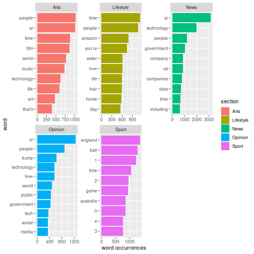

:::::::::::::::::::::::::::::::::::::: questions 

- How is a frequency analysis conducted?

::::::::::::::::::::::::::::::::::::::::::::::::

::::::::::::::::::::::::::::::::::::: objectives

- Learn how to find frequent words
- Learn how to analyse and visualise it


::::::::::::::::::::::::::::::::::::::::::::::::


## Frequency analysis

A word frequency is a relatively simple analysis. It measures how often words occur in a text. 


``` r
articles_anti_join |> 
  count(word, sort = TRUE)
```

``` output
# A tibble: 68,899 × 2
   word           n
   <chr>      <int>
 1 it’s        6584
 2 ai          5778
 3 people      4422
 4 time        4277
 5 technology  3946
 6 world       2758
 7 don’t       2131
 8 day         1803
 9 life        1694
10 uk          1690
# ℹ 68,889 more rows
```

The previous code chunk resulted in a list containing the most frequent words. The words are from articles about both presidents, and they are sorted based on frequency with the highest number on top.

A closer look at the list may reveal that some words are irrelevant. Given that the articles in the dataset are about the two presidents' respective inaugurations, we consider the words below irrelevant for our analysis. Therefore, we make a new dataset without these words.


``` r
articles_filtered <- articles_anti_join |> 
  filter(!word %in% c("it’s", "don’t"))

articles_filtered |> 
  count(word, sort = TRUE)
```

``` output
# A tibble: 68,897 × 2
   word           n
   <chr>      <int>
 1 ai          5778
 2 people      4422
 3 time        4277
 4 technology  3946
 5 world       2758
 6 day         1803
 7 life        1694
 8 uk          1690
 9 that’s      1667
10 government  1644
# ℹ 68,887 more rows
```
The words deemed irrelevant are no longer on the list above.

Instead of a general list it may be more interesting to focus on the most frequent words belonging to articles about the two presidents respectively.


``` r
articles_filtered |> 
  count(section, word, sort = TRUE)
```

``` output
# A tibble: 138,065 × 3
   section   word           n
   <chr>     <chr>      <int>
 1 News      ai          3131
 2 News      technology  1993
 3 Sport     england     1371
 4 Sport     ball        1287
 5 Opinion   ai          1250
 6 Sport     1           1239
 7 News      people      1196
 8 Lifestyle time        1117
 9 Lifestyle people      1062
10 Sport     time        1050
# ℹ 138,055 more rows
```

Keeping an overview of the words associated with each section can be a bit tricky. For instance, the word "time" is associated with both lifestyle and sport. This is easy to see, as the two words are right next to each other, but what if the words are further apart.


<!-- ```{r top_ten_words_pr_president}
articles_filtered |> 
  count(section, word, sort = TRUE) |> 
  group_by(section) |> 
  slice(1:5) |> 
  ggplot(mapping = aes(x = n, y = word, colour = section, shape = section)) +
  geom_point() 
``` -->

<!-- The plot above shows the top-five words associated with the sections respectively. If a word features on multiple sections' top-five list, it only occurs once in the plot. This is why the plot doesn't contain 35 words in total. -->

Another way of looking at the words compared with eachother in section could be a table where we count the words used pr sections easily comparable. In this analysis the section is the guiding principle.


``` r
articles_filtered |> 
  count(section, word, sort = TRUE) |> 
  pivot_wider(
    names_from = section,
    values_from = n
  )
```

``` output
# A tibble: 68,897 × 6
   word        News Sport Opinion Lifestyle  Arts
   <chr>      <int> <int>   <int>     <int> <int>
 1 ai          3131    36    1250       351  1010
 2 technology  1993   294     565       466   628
 3 england      106  1371      41        27    47
 4 ball           5  1287      11        40    20
 5 1             89  1239      40       106    73
 6 people      1196   250     883      1062  1031
 7 time         676  1050     551      1117   883
 8 government  1024    19     429        65   107
 9 2             68   968      25       161   119
10 game          25   953      31       144   386
# ℹ 68,887 more rows
```

We can also visualize word frequency. In the following we will visualize what the top 10 word used in each section is


``` r
articles_filtered |> 
  group_by(section) |> 
  count(word, sort = TRUE) |> 
  top_n(10) |> 
  ungroup() |> 
  mutate(word = reorder_within(word, n, section)) |> 
  ggplot(aes(n, word, fill = section)) +
  geom_col() +
  facet_wrap(~section, scales = "free") +
  scale_y_reordered() + 
  labs(x = "word occurrences")
```

``` output
Selecting by n
```



<!-- The analyses just made can easily be adjusted. For instance, if we want look at the words by `pillar_name` instead of by `president`, we simply replace `president` with `pillar_name` in the code.


```` r
articles_filtered |> 
  count(date, word, sort = TRUE) |> 
  group_by(date) |> 
  slice(1:10) |> 
  ggplot(mapping = aes(x = n, y = word, colour = date, shape = date)) +
  geom_point() 
``` -->

Interesting that numbers occurs in the Sports section. Lets have a look at where it occurs. In order to do so we have to go back to our original object `articles` where we have the full text of articles.
````

``` error
Error in parse(text = input): attempt to use zero-length variable name
```

``` r
articles |> 
  filter(section == "Sport") |> 
  filter(str_detect(text, "\\b1\\b")) |> 
  select(text) |> 
  head()
```

``` output
# A tibble: 6 × 1
  text                                                                          
  <chr>                                                                         
1 Sonia Bompastor, the Chelsea head coach, called for goalline technology to be…
2 When the Wimbledon organisers announced last year that electronic line-callin…
3 Barcelona foiled by Bayern’s block Alexia Putellas said Barcelona have to “ad…
4 The Australia fast bowler Mitchell Starc has urged the International Cricket …
5 Semi-automated offside technology (SAOT) failed during the Carabao Cup semi-f…
6 Renée Slegers said teams in the Women’s Super League “need just decisions” an…
```

<!-- SNAK MED CHRISTIAN ANG at få ordet i kontekst, så 10 ord før og 10 ord efter -->


::::::::::::::::::::::::::::::::::::: keypoints 

- Making a frequency analysis
- Visualising the results


::::::::::::::::::::::::::::::::::::::::::::::::
