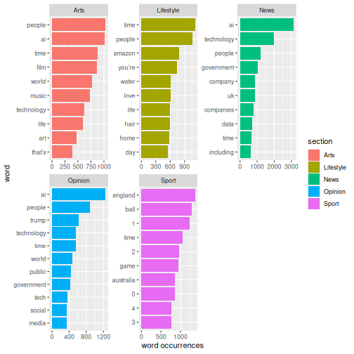

:::::::::::::::::::::::::::::::::::::: questions 

- How is a frequency analysis conducted?

::::::::::::::::::::::::::::::::::::::::::::::::

::::::::::::::::::::::::::::::::::::: objectives

- Learn how to find frequent words
- Learn how to analyse and visualise it


::::::::::::::::::::::::::::::::::::::::::::::::


## Frequency analysis

A word frequency is a relatively simple analysis. It measures how often words occur in a text. 


``` r
articles_anti_join |> 
  count(word, sort = TRUE)
```

``` output
# A tibble: 68,899 × 2
   word           n
   <chr>      <int>
 1 it’s        6584
 2 ai          5778
 3 people      4422
 4 time        4277
 5 technology  3946
 6 world       2758
 7 don’t       2131
 8 day         1803
 9 life        1694
10 uk          1690
# ℹ 68,889 more rows
```

The previous code chunk resulted in a list containing the most frequent words. The words are from articles about both presidents, and they are ordered by frequency with the highest number on top.

A closer look at the list may reveal that some words are irrelevant. Given that the articles in the dataset are about the two presidents' respective inaugurations, we consider the words below irrelevant for our analysis. Therefore, we make a new dataset without these words.

Notice that the we use a "!" as part of the filter function. By doing that, we filter on anything but the words inside the parenthesis.


``` r
articles_filtered <- articles_anti_join |> 
  filter(!word %in% c("it’s", "don’t"))

articles_filtered |> 
  count(word, sort = TRUE)
```

``` output
# A tibble: 68,897 × 2
   word           n
   <chr>      <int>
 1 ai          5778
 2 people      4422
 3 time        4277
 4 technology  3946
 5 world       2758
 6 day         1803
 7 life        1694
 8 uk          1690
 9 that’s      1667
10 government  1644
# ℹ 68,887 more rows
```
The words deemed irrelevant are no longer on the list above.

Instead of a general list it may be more interesting to focus on the most frequent words in certain sections from The Guardian.


``` r
articles_filtered |> 
  count(section, word, sort = TRUE)
```

``` output
# A tibble: 138,065 × 3
   section   word           n
   <chr>     <chr>      <int>
 1 News      ai          3131
 2 News      technology  1993
 3 Sport     england     1371
 4 Sport     ball        1287
 5 Opinion   ai          1250
 6 Sport     1           1239
 7 News      people      1196
 8 Lifestyle time        1117
 9 Lifestyle people      1062
10 Sport     time        1050
# ℹ 138,055 more rows
```

Keeping an overview of the words associated with each section can be a bit tricky. For instance, the word "time" is associated with both lifestyle and sport. <!--This is easy to see, as the two words are right next to each other. But what if the words are further apart? -->


<!-- ```{r top_ten_words_pr_president} -->
 <!-- articles_filtered |> 
   count(section, word, sort = TRUE) |> 
   group_by(section) |> 
   slice(1:5) |> 
   ggplot(mapping = aes(x = n, y = word, colour = section, shape = section)) +
   geom_point()  -->
<!-- ``` -->

<!-- The plot above shows the top-five words associated with the sections respectively. If a word features on multiple sections' top-five list, it only occurs once in the plot. This is why the plot doesn't contain 35 words in total. -->

Another way of comparing words across different sections could by counting them per section. In the example below, the section is the guiding principle. 


``` r
articles_filtered |> 
  count(section, word, sort = TRUE) |> 
  pivot_wider(
    names_from = section,
    values_from = n
  )
```

``` output
# A tibble: 68,897 × 6
   word        News Sport Opinion Lifestyle  Arts
   <chr>      <int> <int>   <int>     <int> <int>
 1 ai          3131    36    1250       351  1010
 2 technology  1993   294     565       466   628
 3 england      106  1371      41        27    47
 4 ball           5  1287      11        40    20
 5 1             89  1239      40       106    73
 6 people      1196   250     883      1062  1031
 7 time         676  1050     551      1117   883
 8 government  1024    19     429        65   107
 9 2             68   968      25       161   119
10 game          25   953      31       144   386
# ℹ 68,887 more rows
```

# Proportion
Simply counting the words does not give us any information about proportional distribution. For instance, in the AI row, we do not know if the 3131 ocurrences of AI in the news is a lot compared to the 1250 ocurrences in the opinion section.

Therefore, let us have a look at how it looks if we make the same query, but with proportion insted of word count.


``` r
articles_filtered |> 
  count(section, word) |> 
  group_by(section) |> 
  mutate(proportion = n / sum(n)) |> 
  ungroup() |> 
  select(-n) |> 
  arrange(desc(proportion)) |>
  pivot_wider(
    names_from = section,
    values_from = proportion)
```

``` output
# A tibble: 68,897 × 6
   word            News   Opinion    Sport      Arts Lifestyle
   <chr>          <dbl>     <dbl>    <dbl>     <dbl>     <dbl>
 1 ai         0.0125    0.00809   0.000175 0.00450   0.00128  
 2 technology 0.00795   0.00366   0.00143  0.00280   0.00170  
 3 england    0.000423  0.000265  0.00668  0.000209  0.0000984
 4 ball       0.0000199 0.0000712 0.00627  0.0000891 0.000146 
 5 1          0.000355  0.000259  0.00604  0.000325  0.000386 
 6 people     0.00477   0.00571   0.00122  0.00459   0.00387  
 7 time       0.00270   0.00357   0.00512  0.00393   0.00407  
 8 2          0.000271  0.000162  0.00472  0.000530  0.000587 
 9 game       0.0000997 0.000201  0.00465  0.00172   0.000525 
10 australia  0.00106   0.000912  0.00417  0.000401  0.000153 
# ℹ 68,887 more rows
```


# Visualization

We can also visualize word frequency. Below is a visualisation of the 10 most frequent words in each section. The plots do not contain information about proportions, though the x-axis does give us information about the size of each section.


``` r
articles_filtered |> 
  group_by(section) |> 
  count(word, sort = TRUE) |> 
  top_n(10) |> 
  ungroup() |> 
  mutate(word = reorder_within(word, n, section)) |> 
  ggplot(aes(n, word, fill = section)) +
  geom_col() +
  facet_wrap(~section, scales = "free") +
  scale_y_reordered() + 
  labs(x = "word occurrences")
```

``` output
Selecting by n
```



<!-- The analyses just made can easily be adjusted. For instance, if we want look at the words by `pillar_name` instead of by `president`, we simply replace `president` with `pillar_name` in the code. -->

<!-- ```{r vis_per_pillar} -->
<!-- articles_filtered |> 
  count(date, word, sort = TRUE) |> 
  group_by(date) |> 
  slice(1:10) |> 
  ggplot(mapping = aes(x = n, y = word, colour = date, shape = date)) +
  geom_point()  -->
<!-- ``` -->


A close look at the plot belonging to the Sport section reveals that numbers occur five times. In order to find out what is behind these numbers, we have to return to the original dataset `articles`. The reason we have to use the original dataset is that it still has the intact text. Below, we investigate which words sorround the number "1".

For this purpose we need a `package` named `quanteda`. First, the package is installed, and then it is activated.


``` r
install.packages("quanteda")
library(quanteda)
```

To get the context, we use the function `kwic`.


``` r
articles_context <- articles |> 
  filter(section == "Sport") |> 
  # filter(str_detect(text, "\\b1\\b")) |> 
  # slice(1) |> 
  pull(text) |> 
  tokens() |>
  kwic(pattern = "1", window = 10)

articles_context |> head()
```

``` output
Keyword-in-context with 6 matches.                                                                         
   [text4, 270] and Emma Raducanu, the men’s and women’s British No | 1 |
  [text40, 377]                 ), 6-3 win in front of a roaring No | 1 |
   [text43, 28]               not “ 100% accurate ”. The British No | 1 |
  [text51, 785]        court, contended Jane Carter, 58, outside No | 1 |
  [text51, 850]     down the game. Standing beneath the shade of No | 1 |
 [text52, 2416]                he said. “ I would have been your No | 1 |
                                                            
 players, who each criticised the ELC system following their
 Court crowd. Spectators appeared to boo Jarry when the     
 said it was “ a shame ” human line judges                  
 Court. “ I would think that it would improve               
 Court, Tom Mansell said the technology takes the “         
 proponent after Joe Biden. ” The former president is       
```

We are looking for at keyword in context, and this is exactly what the function `kwic` does. It locates the string we write in the argument `pattern` and takes the amount of words before and after the keyword given in the argument `window`. In this case the number of words before and after "1" is set to 10.

It may be worth saving the result, so that it can be analysed further. One way of doing this is by saving it as a csv-file.


::::::::::::::::::::::::::::::::::::: keypoints 

- Making a frequency analysis
- Visualising the results


::::::::::::::::::::::::::::::::::::::::::::::::
