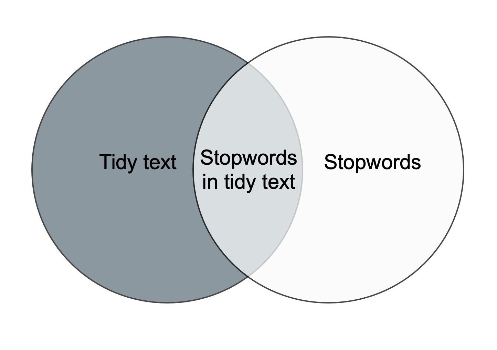

::: questions
-   How is text prepared for analysis?
:::

::: objectives
-   Ability to tokenise a text
-   Ability to remove stopwords from text
:::


## Tokenisation

Since we are working with text mining, we focus on the `text` coloumn. We do this because the coloumn contains the text from the articles in question.

To tokenise a column, we use the functions `unnest_tokens()` from the `tidytext`-package. The function gets two arguments. The first one is `word`. This defines that the text should be split up by words. The second argument, `text`, defines the column that we want to tokenise.


``` r
articles_tidy <- articles |> 
  unnest_tokens(word, text)
articles_tidy
```

``` output
# A tibble: 2,405,300 × 7
      id date    section region author                          wordcount word  
   <dbl> <chr>   <chr>   <chr>  <chr>                               <dbl> <chr> 
 1     1 2026-05 News    UK     Jessica Murray and Robert Booth      1328 brita…
 2     1 2026-05 News    UK     Jessica Murray and Robert Booth      1328 biome…
 3     1 2026-05 News    UK     Jessica Murray and Robert Booth      1328 watch…
 4     1 2026-05 News    UK     Jessica Murray and Robert Booth      1328 have  
 5     1 2026-05 News    UK     Jessica Murray and Robert Booth      1328 warned
 6     1 2026-05 News    UK     Jessica Murray and Robert Booth      1328 that  
 7     1 2026-05 News    UK     Jessica Murray and Robert Booth      1328 natio…
 8     1 2026-05 News    UK     Jessica Murray and Robert Booth      1328 overs…
 9     1 2026-05 News    UK     Jessica Murray and Robert Booth      1328 of    
10     1 2026-05 News    UK     Jessica Murray and Robert Booth      1328 ai    
# ℹ 2,405,290 more rows
```

:::: callout

## Tokenisation

The result of the tokenisation is 2,405,300 rows. The reason is that the `text`-column has been replaced by a new column named `word`. This column contains all words found in all of the articles. The information from the remaining columns are kept. This makes is possible to determine which article each word belongs to.

Note that we can only see part of the word column's content.

::::

## Stopwords

The next step is to remove stopwords. We have chosen to use the stopword list from the package `tidytext`. The list contains 1,149 words that are considered stopwords. Other lists are available, and they differ in terms of how many words they contain.


``` r
data(stop_words)
stop_words
```

``` output
# A tibble: 1,149 × 2
   word        lexicon
   <chr>       <chr>  
 1 a           SMART  
 2 a's         SMART  
 3 able        SMART  
 4 about       SMART  
 5 above       SMART  
 6 according   SMART  
 7 accordingly SMART  
 8 across      SMART  
 9 actually    SMART  
10 after       SMART  
# ℹ 1,139 more rows
```

::: discussion
### Adding and removing stopwords

You may find yourself in need of either adding or removing words from the stopwords list.

Here is how you add and remove stopwords to a predefined list.
:::

::: solution
### Add stopwords

First, create a tibble with the word you wish to add to the stopwords list


``` r
new_stop_words <- tibble(
  word = c("cat", "dog"),
  lexicon = "my_stopwords"
)
```

Then make a new stopwords tibble based on the original one, but with the new words added.


``` r
updated_stop_words <- stop_words |>
  bind_rows(new_stop_words)
```

Run the following code to see that the added lexicon `my_stopwords` contains two words.


``` r
updated_stop_words |> 
  count(lexicon)
```

``` output
# A tibble: 4 × 2
  lexicon          n
  <chr>        <int>
1 SMART          571
2 my_stopwords     2
3 onix           404
4 snowball       174
```
:::

::: solution
### Remove stopwords

First, create a vector with the word(s) you wish to remove from the stopwords list.


``` r
words_to_remove <- c("cat", "dog")
```

Then remove the rows containing the unwanted words.


``` r
updated_stop_words <- stop_words |>
  filter(!word %in% words_to_remove)
```

Run the following code to see that the added lexicon `my_stopwords` nolonger exists.


``` r
updated_stop_words |> 
  count(lexicon)
```

``` output
# A tibble: 3 × 2
  lexicon      n
  <chr>    <int>
1 SMART      571
2 onix       404
3 snowball   174
```
:::

In order to remove stopwords from `articles_tidy`, we have to use the `anti_join`-function.


``` r
articles_anti_join <- articles_tidy |> 
  anti_join(stop_words, by = "word")
articles_anti_join
```

``` output
# A tibble: 1,118,028 × 7
      id date    section region author                          wordcount word  
   <dbl> <chr>   <chr>   <chr>  <chr>                               <dbl> <chr> 
 1     1 2026-05 News    UK     Jessica Murray and Robert Booth      1328 brita…
 2     1 2026-05 News    UK     Jessica Murray and Robert Booth      1328 biome…
 3     1 2026-05 News    UK     Jessica Murray and Robert Booth      1328 watch…
 4     1 2026-05 News    UK     Jessica Murray and Robert Booth      1328 warned
 5     1 2026-05 News    UK     Jessica Murray and Robert Booth      1328 natio…
 6     1 2026-05 News    UK     Jessica Murray and Robert Booth      1328 overs…
 7     1 2026-05 News    UK     Jessica Murray and Robert Booth      1328 ai    
 8     1 2026-05 News    UK     Jessica Murray and Robert Booth      1328 power…
 9     1 2026-05 News    UK     Jessica Murray and Robert Booth      1328 scann…
10     1 2026-05 News    UK     Jessica Murray and Robert Booth      1328 catch 
# ℹ 1,118,018 more rows
```

The `anti_join`-function removes the stopwords from the orginal dataset. This is illustrated in the figure below. The only part left after anti-joining is the dark grey area to the left.

These words are saved as the object `articles_anti_join`.

{alt='Figure showing what happens when you perform an anti_join on two datasets'}

::: callout
### `Join` and `anti_join`

There are multiple `join`-functions in R. [Read more](https://r4ds.hadley.nz/joins.html){target="_blank"}

:::


<!-- ```{r write_csv, include = FALSE}
write_csv(articles_anti_join, "data/articles_anti_join.csv")
``` -->

::: keypoints
-   Know how to prepare text for analysis
:::
